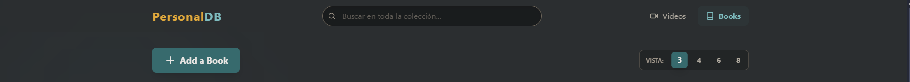

# 📚 MediaVault - Personal Media Manager

> Una aplicación Full-Stack robusta para gestionar colecciones personales de Libros y Videos, diseñada con un enfoque en la experiencia de usuario, portabilidad de datos y estética Gruvbox.



## 🚀 Descripción

**Curator** nació de la necesidad de organizar recursos de aprendizaje y entretenimiento en un solo lugar, sin depender de algoritmos externos. Permite catalogar videos y libros, etiquetarlos con un sistema inteligente de categorías y realizar búsquedas instantáneas.

El proyecto destaca por su capacidad de cambiar de motor de base de datos (MySQL <-> SQLite) y su sistema de preservación de datos mediante "Snapshots JSON".

## ✨ Características Principales

* **🔍 Buscador Universal (Client-Side):** Filtrado instantáneo por título o categoría en tiempo real, sin latencia de red.
* **🏷️ Categorización Inteligente:** Sistema de etiquetas tipo "Chips" con autocompletado y gestión de relaciones Muchos-a-Muchos.
* **👁️ Vistas Dinámicas:** Selector de densidad de información (3, 6 u 8 columnas) con persistencia en LocalStorage.
* **💾 Arquitectura Híbrida:** Configurado para funcionar con **SQLite** (Modo Portátil) o **MySQL** (Modo Servidor), con scripts de migración incluidos.
* **🛡️ Data Safety:** Sistema de backups automáticos al inicio y exportación a `MASTER_BACKUP.json` para portabilidad total.
* **🎨 UI/UX Personalizada:** Diseño basado en la paleta de colores **Gruvbox**, con transiciones suaves y modo inmersivo.

## 🛠️ Tecnologías Utilizadas

### Frontend
*  **React + Vite**
*  **TypeScript**
*  **Tailwind CSS**
* **React Router DOM** (Navegación SPA)
* **Lucide React** (Iconografía)

### Backend
*  **Node.js**
*  **Express**
*  **Sequelize ORM**
*  **SQLite** (Default)
* **Multer** (Gestión de subida de archivos)

## 📦 Instalación y Uso

Este proyecto utiliza una arquitectura monorepo simplificada.

1.  **Clonar el repositorio:**
    ```bash
    git clone [https://github.com/TU_USUARIO/curator.git](https://github.com/TU_USUARIO/curator.git)
    cd curator
    ```

2.  **Instalar dependencias (Front & Back):**
    ```bash
    npm run install-all
    ```

3.  **Iniciar la aplicación:**
    ```bash
    npm run dev
    ```
    *Esto levantará el Backend en el puerto `3000` y el Frontend en el `5173` simultáneamente.*

## 📂 Estructura del Proyecto

```text
src/
├── api/           # Capa de comunicación con el Backend (Axios)
├── components/    # UI Reutilizable (ItemCard, Navbar, ViewToggle)
├── pages/         # Vistas principales (Home, Search, Details)
└── ...
backend/
├── src/
│   ├── controllers/  # Lógica de negocio
│   ├── models/       # Definición de tablas (Sequelize)
│   └── utils/        # Scripts de limpieza y backup
├── uploads/          # Almacenamiento de imágenes
└── database.sqlite   # Base de datos local
